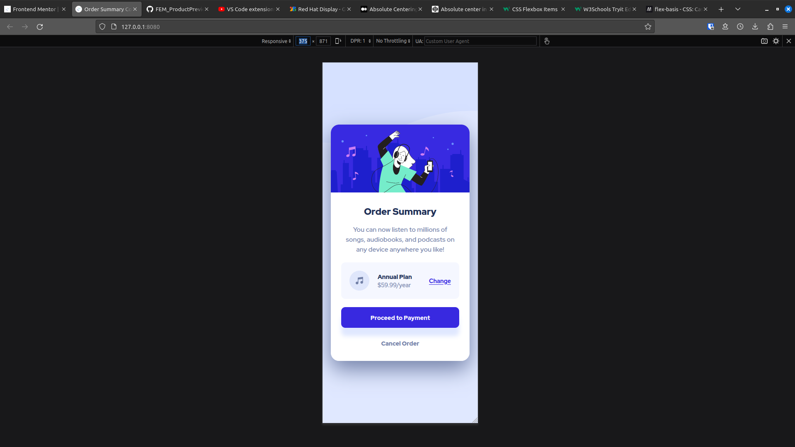

# Frontend Mentor - Order summary card solution

This is a solution to the [Order summary card challenge on Frontend Mentor](https://www.frontendmentor.io/challenges/order-summary-component-QlPmajDUj). Frontend Mentor challenges help you improve your coding skills by building realistic projects. 

## Table of contents

- [Overview](#overview)
  - [The challenge](#the-challenge)
  - [Screenshot](#screenshot)
  - [Links](#links)
- [My process](#my-process)
  - [Built with](#built-with)
  - [Useful resources](#useful-resources)
- [Author](#author)
- [Acknowledgments](#acknowledgments)

## Overview

### The challenge

Users should be able to:

- See hover states for interactive elements

### Screenshot

#### Mobile View

#### Desktop View

### Links

- [Solution]()
- [Live Site]()

## My process

### Built with

- Semantic HTML5 markup
- SASS custom properties
- Flexbox
- CSS Grid
- Mobile-first workflow
- SMACCS

### Useful resources

- [SMACCS](https://smacss.com/) - Useful guide for structuring and organizing CSS/SASS files

## Author

- Frontend Mentor - [@SuperSonic57](https://www.frontendmentor.io/profile/SuperSonic57)

## Acknowledgments

- SASS reset derived from those created by Andy Bell and Kevin Powell